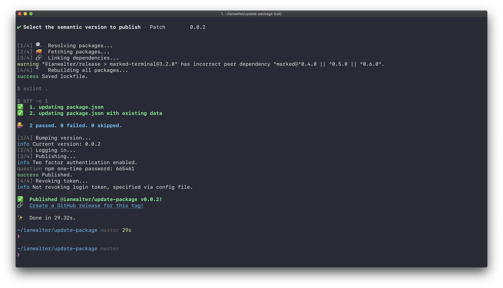

# @ianwalter/release
> CLI workflow for releasing JavaScript packages

[![npm page][npmImage]][npmUrl]
[![CI][ciImage]][ciUrl]



## About

**HEAVILY** inspired by [np][npUrl] but with the following features:

* Focused on [`yarn`][yarnUrl] (and [`lerna`][lernaUrl] in the future)
* A release branch workflow to help with GitHub master branch protections
* Support for multiple (and external) registries

## Workflow

- [x] Check and fail if there are uncommited changes in the working directory
- [x] Check and fail if upstream has new commits
- [x] Display commits and prompt for a new semantic version if one wasn't
      specified as the first arugment
- [x] Check and fail if version tag already exists locally or on remote
- [x] Re-install dependencies
- [x] Run linting if there's a lint script
- [x] Run tests if there's a test script
- [x] If `--branch` is specified, create a release branch, push it, link to a
      new PR, and prompt for a confirmation to publish
- [x] Update the version in `package.json` and commit the version bump
- [x] Create a tag and push it up
- [x] Publish the package and display a link to create a new GitHub release with
      the tag from the previous step
- [x] If `--yolo` is specified, most of checks are skipped and the last 3 steps
      are executed

## Installation

```console
yarn add @ianwalter/release --dev
```

## CLI Usage

If you've installed `release` as a develoment dependency you can run it like:

```console
yarn release [version]
```

The version number is optional. If not specified, you will be prompted for one.

* `--access, -a <public|restricted>` [Tells the registry whether this package
  should be published as public or restricted. Only applies to scoped packages,
  which default to restricted. If you don’t have a paid account, you must
  publish with --access public to publish scoped packages.][npmPublishUrl]
* `--branch, -b` Specifies `release` should publish from a release branch. The
  name of the branch is autogenerated based on the version unless given a value.
* `--yolo, -y` You Only Live Once. Disable most of the checks and publish the
  thing.
* `--logLevel, -l` Specifies the log level `release` will use. Set to `debug` if
  you are having trouble!

## Multiple Registries

You can specify that your package be published to multiple registries by
configuring `release` in your package.json, for example:

```js
{
  "release": {
    "registries": [
      "npm",
      "github",
      "https://some.other.registry.com/"
    ]
  }
}
```

You can specify `npm` for npm and `github` for GitHub Package Registry.
Otherwise, specify the registry URL.

## Release Branch Workflow

[GitHub branch protections][protectionsUrl] can make it difficult to commit
version updates to your package.json before publishing. In order to get around
this, you can specify the `--branch` flag and `release` will automatically
create a release branch, commit the version update, and link to the pull request
creation page on GitHub. It will then prompt you to confirm before publishing
(unless you added the `--yolo` flag) so that you can get the PR reviewed. You
can also supply a branch name to `--branch` if you don't want to use the
generated one.

## License

Hippocratic License - See [LICENSE][licenseUrl]

&nbsp;

Created by [Ian Walter](https://ianwalter.dev)

[npmImage]: https://img.shields.io/npm/v/@ianwalter/release.svg
[npmUrl]: https://www.npmjs.com/package/@ianwalter/release
[ciImage]: https://github.com/ianwalter/release/workflows/CI/badge.svg
[ciUrl]: https://github.com/ianwalter/release/actions
[npUrl]: https://github.com/sindresorhus/np
[yarnUrl]: https://yarnpkg.com/en/
[lernaUrl]: https://lerna.js.org/
[npmPublishUrl]: https://docs.npmjs.com/cli/publish
[protectionsUrl]: https://help.github.com/en/articles/about-protected-branches
[licenseUrl]: https://github.com/ianwalter/release/blob/master/LICENSE
